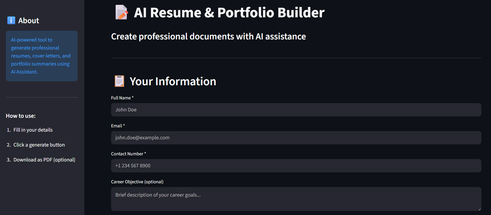

# 📝 AI Resume & Portfolio Builder

<div align="center">
  
  
  
  


  <br>
</div>

---

A powerful Streamlit web application that leverages AI to generate professional resumes, cover letters, and portfolio summaries using the Meta Llama Maverick Model. Deployed on Streamlit and made for professionals to create high rate and effective employment solutions.

## 🚀 Deployment

[](https://ai-resume-and-portfolio-build.streamlit.app)

[](https://ai-resume-and-portfolio-build.streamlit.app)


## 📱 Demo

  <table>
  <tr>
    <td align="center">
      
      <br/>
      <b>Homepage View</b>
    </td>
  </tr>
</table>


## 🚀 Quick Start

### Prerequisites

- Python 3.8 or higher
- Cerebras API key (obtain from [Cerebras](https://cerebras.ai))

### Installation

1. **Clone the repository**
   ```bash
   git clone https://github.com/shubhamaher8/AI-Resume-And-Portfolio-Builder.git
   cd AI-Resume-And-Portfolio-Builder
   ```

2. **Install dependencies**
   ```bash
   pip install -r requirements.txt
   ```

3. **Set up environment variables**
   ```bash
   CEREBRAS_API_KEY=your_actual_api_key_here
   ```

4. **Run the application**
   ```bash
   streamlit run app.py
   ```

5. **Open your browser**
   - The app will automatically open at `http://localhost:8501`

## 📊 Project Structure

```
AI-Resume-And-Portfolio-Builder/
├── app.py              # Main application file
├── requirements.txt    # Python dependencies
├── .gitattributes    
├── .env                # environment variables
├── .gitignore          # Git ignore rules
└── README.md           # Readme file
```

## 🎯 Features

- **AI-Powered Generation**: Uses AI (`llama-4-maverick-17b-128e-instruct`) to create professional documents.
- **Three Document Types**:
  - Professional Resume
  - Compelling Cover Letter
  - Portfolio Summary
- **PDF Export**: Download generated documents as PDF files
- **User-Friendly Interface**: Clean, intuitive Streamlit UI

## 📋 How to Use

1. **Fill in Your Information**
   - Enter your personal details (name, email, phone)
   - Add education details
   - List your skills (comma-separated)
   - Describe work experience or internships
   - Optionally add career objective and projects

2. **Generate Documents**
   - Click **"Generate Resume"** for a professional resume
   - Click **"Generate Cover Letter"** for a compelling cover letter
   - Click **"Generate Portfolio Summary"** for a skills and projects overview

3. **Download**
   - Click **"Download as PDF"** to save the generated document
   - The PDF will be named using your name and document type

## 🛠️ Tech Stack

- **Frontend**: Streamlit
- **Backend**: Python
- **AI API**: Cerebras API (llama-4-maverick-17b-128e-instruct)
- **PDF Generation**: FPDF
- **Environment Management**: python-dotenv

### API Configuration

The application uses the following Cerebras API settings:
- **Model**: `llama-4-maverick-17b-128e-instruct`
- **Endpoint**: `https://api.cerebras.ai/v1/chat/completions`
- **Temperature**: 0.7
- **Max Tokens**: 2000

## 💡 Tips

- Be specific in your input fields for better AI-generated content
- Use comma-separated values for skills
- Provide detailed work experience for more comprehensive documents
- Include quantifiable achievements when describing experience
- The AI generates fresh content each time, so results may vary slightly

## 🤝 Contributing

Contributions are welcome! Please feel free to submit a Pull Request.

## 📄 License

This project is open source and available under the MIT License.
